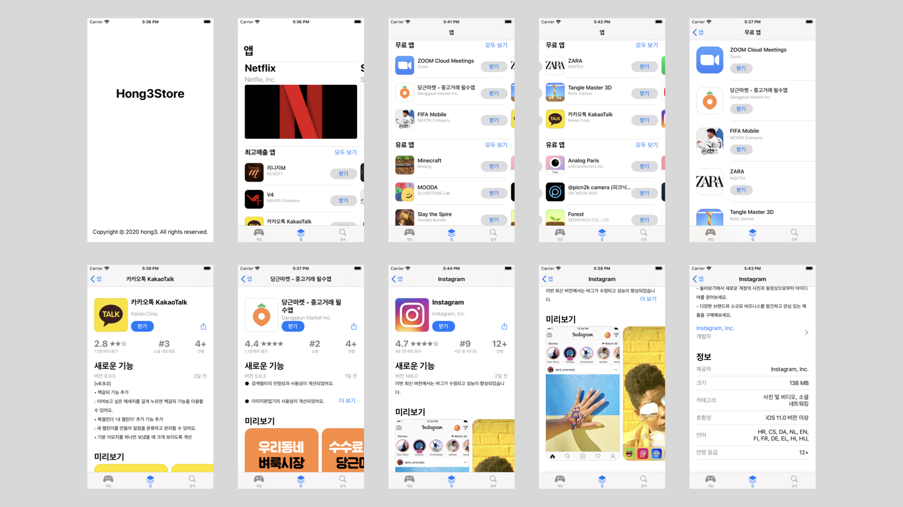

# Hong3Store
> 패스트캠퍼스 iOS School 진행 했던 해커톤 프로젝트

> 현재 테스트 코드를 작성해보고 있습니다.

## 설명
- 기간: 2020.03.02 ~ 2020.03.13
- 사용 기술:
  - 언어: Swift
  - 프레임워크: UIKit
- 인원: 1명
- 성과:
  - 해커톤 자체 평가 2위
  - NSCache를 사용하여 Cell호출시 이미지를 매번 호출하던 문제 해결
  - Dispatch Group을 사용하여 UI 순서가 꼬이던 문제를 해결
  - TableView와 CollectionView를 같이 사용해보며, 많은 앱들이 비슷한 형태를 띄고 있다는것을 파악하게 되었고
  - [마켓컬리 클론앱]((https://github.com/hongdonghyun/iOS-team3))에서 많은 도움이 되었다.
  - 테스트 코드를 적용하여 테스트 코드 작성을 연습중
  - 해당 앱을 만들어보며 자신감을 많이 얻게 되었음

## 결과

> 클릭시 유튜브로 이동합니다.
